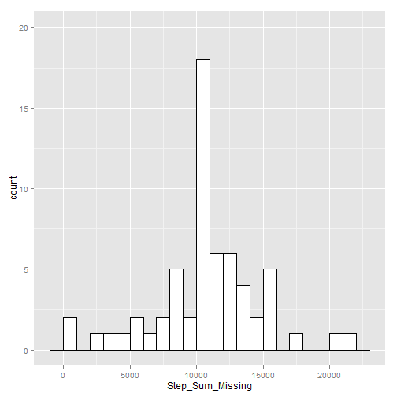

<br>

## Loading and preprocessing the data
Load libraries, read in data, and ensure data are in the right format

```r
library(ggplot2)
activityDat <- read.csv("activity.csv")
activityDat$date <- as.Date(activityDat$date, format = "%Y-%m-%d")
```
<br><br>

## What is mean total number of steps taken per day?

#### Calculate and store the total number of steps taken per day.  

```r
totSteps <- setNames(aggregate(activityDat$steps, 
          list(activityDat$date), sum), c("Date", "Step_Sum"))
```
<br>

#### Histogram of the total number of steps

```r
ggplot(totSteps, aes(x=Step_Sum)) + 
  geom_histogram(binwidth=1000, fill="white", color="black") +
  ylim(0, 20)
```

 
<br>

#### Mean of the total number of steps 

```r
mean(totSteps$Step_Sum, na.rm=TRUE)
```

```
## [1] 10766.19
```

#### Median of the total number of steps 

```r
median(totSteps$Step_Sum, na.rm=TRUE)
```

```
## [1] 10765
```

<br><br>

## What is the average daily activity pattern?
Calculate the average number of steps taken per time interval.

```r
avgSteps <- setNames(aggregate(activityDat$steps, list(activityDat$interval),
                               mean, na.rm=TRUE), c("Interval", "Step_Avg"))
```
<br>

#### Timeseries of average steps per time interval

```r
ggplot(avgSteps, aes(x=Interval, y=Step_Avg)) + geom_line()
```

 
<br>

#### The max # of steps across the averaged data

```r
avgSteps[avgSteps$Step_Avg == max(avgSteps$Step_Avg),]
```

```
##     Interval Step_Avg
## 104      835 206.1698
```

<br><br>

## Imputing missing values

#### # of missing observations

```r
sum(is.na(activityDat$steps))
```

```
## [1] 2304
```
<br>

#### Devise an missing value imputation strategy
I will use the average of that 5-min interval wherever a missing value  
appears to create a new column

```r
activityDat$missingSteps <- avgSteps$Step_Avg
activityDat$missingSteps <- ifelse(is.na(activityDat$steps), 
        activityDat$missingSteps, 
        activityDat$steps)
```
<br>


#### Impute missing # of steps taken per day

```r
totStepsMissing <- setNames(aggregate(activityDat$missingSteps, 
                               list(activityDat$date), sum), c("Date", "Step_Sum_Missing"))
```
<br>

#### Histogram of sum of steps using imputed missing observations

```r
ggplot(totStepsMissing, aes(x=Step_Sum_Missing)) + 
  geom_histogram(binwidth=1000, fill="white", color="black") +
  ylim(0, 20)
```

 
<br>

#### Mean of Step_Sum_Missing

```r
mean(totStepsMissing$Step_Sum_Missing)
```

```
## [1] 10766.19
```

#### Median of Step_Sum_Missing

```r
median(totStepsMissing$Step_Sum_Missing)
```

```
## [1] 10766.19
```
The mean is the same as before, while the median is now the same as the mean.  
Furthermore, the count for the center bar is much higher now.

<br><br>

## Are there differences in activity patterns between weekdays and weekends?

#### Creating a weekday/weekend factor variable

```r
activityDat$day <- as.factor(ifelse(weekdays(activityDat$date) == "Sunday" | 
                            weekdays(activityDat$date) == "Saturday", 
                                   "Weekend", "Weekday"))
```
<br>

#### Calculate the average number of steps taken per time interval

```r
moreAvgSteps <- setNames(aggregate(activityDat$missingSteps, 
                  by=list(activityDat$interval,activityDat$day),mean),
                  c("Interval", "Day", "Step_Avg_Missing"))
```
<br>

#### Timeseries of average steps per time interval

```r
ggplot(moreAvgSteps, aes(x=Interval, y=Step_Avg_Missing)) + geom_line() + facet_grid(Day ~ .)
```

 
